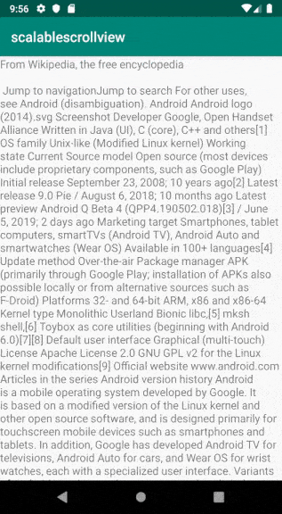

## Scalable ScrollView

 This library is modification of android.widget.ScrollView and allows user to resize TextView,
placed into it, by two fingers.



Just replace your ScrollView with ScalableScrollView in layout.xml

```xml
<?xml version="1.0" encoding="utf-8"?>
<com.artembotnev.view.ScalableScrollView
        xmlns:android="http://schemas.android.com/apk/res/android"
        xmlns:app="http://schemas.android.com/apk/res-auto"
        xmlns:tools="http://schemas.android.com/tools"
        android:layout_width="match_parent"
        android:layout_height="match_parent"
        app:maxScale="2.5"
        tools:context=".MainActivity">

    <TextView
            android:layout_width="wrap_content"
            android:layout_height="wrap_content"
            android:textSize="16sp"
            android:text="@string/android_article" />

</com.artembotnev.view.ScalableScrollView>
```

You can also specify maxScale attribute to define maximum scale for text
